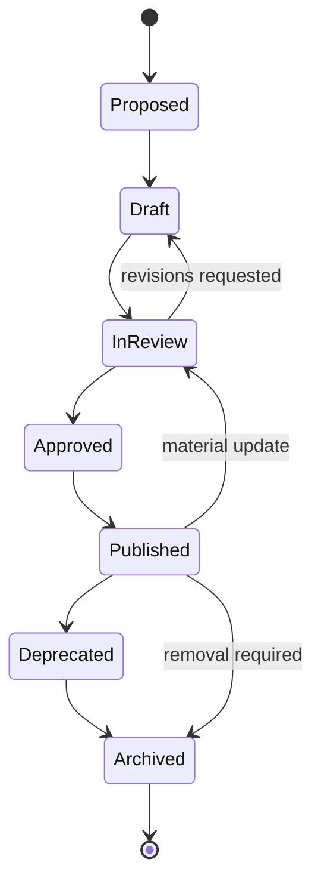

# Content Lifecycle & Governance

## Governance model

The platform needs lightweight but explicit accountability. One person may fill multiple roles initially, but responsibilities remain distinct.

| Role | Accountability |
|---|---|
| Product Owner | Platform priorities, audience outcomes, acceptance |
| Managing Editor | Editorial calendar, consistency, publication decision |
| Content Owner | Accuracy, maintenance, and review of assigned records |
| Public Health Domain Reviewer | Practice applicability and terminology |
| Evidence/Research Reviewer | Source quality, claim support, limitations |
| Governance Reviewers | Privacy, security, equity, accessibility, legal/procurement concerns as applicable |
| Metadata Steward | Taxonomy, IDs, relationships, quality rules |
| Technical Maintainer | Schemas, build, previews, deployment, rollback |
| Organization Verifier | Confirms attributed Project Summary facts when permission is available |

## Lifecycle

### Intake and prioritization

Record audience need, content type, owner, urgency, duplication check, source availability, risks, and intended relationships. Prioritize corrections and safety-sensitive updates ahead of expansion. Contributions do not guarantee publication.

### Drafting and review

Use templates and controlled terms. Factual claims carry sources and limitations. Automated validation runs before human review. Required reviewers are risk-based: all items receive editorial and domain review; evidence claims receive evidence review; content involving privacy, equity, security, legal authority, procurement, or communities receives the applicable specialist review.

### Approval and publication

The Managing Editor confirms review completion and the Content Owner accepts maintenance responsibility. A preview must show the full page, metadata, relationships, and downloads. Production publication records approver, revision, date, and build artifact.

### Maintenance

Default review cadence:

- laws, policy, funding, security, product/tool behavior, and news: at least every 3–6 months or on known change;
- operational guidance, tools, learning, and Project Summaries: annually;
- foundational explanations: every 18 months;
- urgent correction or safety issue: immediate triage.

Automated reminders begin 30 days before `review_due`. Overdue content receives a visible internal flag; high-risk stale content may receive a public freshness notice or be unpublished.

### Deprecation and archival

Deprecation explains what replaced the item and preserves stable URLs. Archive when material is obsolete, rights require removal, sources no longer support claims, or maintenance has ended. Keep tombstone metadata and redirects when lawful; generated downloads must be removed or visibly superseded.

## Project Summary governance

Preserve the existing comparison presentation. Before publication, reviewers must distinguish expected benefits from measured outcomes, identify source type, verify the agency attribution, document last verification, and avoid turning vendor assertions into validated best practices. Organization verification is preferred but not required when reliable public sources support the summary; the status must say which occurred.

Promising Practices remain clearly separated and disclose synthesis. Their illustrative outcome statements must not look like measured real-world results unless a cited implementation supports them.

## Corrections and incidents

Every page links to a correction channel. Triage errors by severity:

- **Critical:** harmful, privacy/security-sensitive, legally misleading, false agency attribution—restrict or correct immediately and notify owners.
- **Major:** unsupported outcome, material factual error, broken required tool—correct in the next expedited release.
- **Minor:** style, non-material wording, secondary link—normal editorial queue.

Record the issue, decision, change, reviewer, publication time, and whether users or attributed organizations need notice. Maintain a public correction note for material changes.

## Rights, consent, and responsible contribution

Store license/rights for media and downloads. Obtain consent for identifiable contributor profiles, quotations, and non-public organizational information. Never accept protected health information, confidential agency data, credentials, or restricted records through contribution forms. Publish contribution terms and a retention schedule.

## Change control

Schema, taxonomy, numbering, scoring, or presentation changes require a documented impact assessment and migration plan. Changes to the Project Summary visible sections require a demonstrated user need and approval; adding structured metadata behind the presentation is backward-compatible. All releases need rollback capability.
