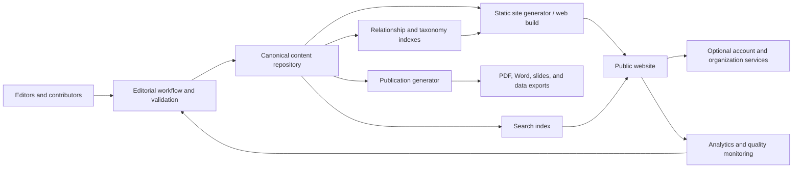

# Platform Architecture v1

## Purpose and scope

The AI Playbook should evolve from a static website prototype into a public health AI knowledge platform without disrupting the useful public experience already in place. Version 1 establishes a canonical content layer, publishing workflow, relationship graph, search model, and service boundaries. It does not require immediate replacement of the current front end.

## Architecture principles

1. **Website-authoritative migration.** The live site is the source baseline. Migration must reconcile against it before any new store becomes authoritative.
2. **Create once, publish many.** Website pages, indexes, crosswalks, role pathways, and downloadable documents derive from canonical records.
3. **Stable identity over location.** Every object has an immutable ID; URLs and navigation may change without breaking relationships.
4. **Relationships are data.** Connections among plays, tools, learning, cases, references, roles, domains, and organizations are explicit and validated.
5. **Evidence is visible.** Source, evidence status, review date, jurisdiction, and claim limitations travel with the content.
6. **Progressive enhancement.** Core public content remains accessible without account services or client-side persistence.
7. **Public-health safeguards.** Accessibility, privacy, security, equity, scientific integrity, records obligations, and human oversight are architecture concerns.
8. **Portability.** Content uses documented, repository-readable formats and can be exported without vendor lock-in.
9. **One repository, multiple editions.** The full platform and customer-facing Foundation Edition are separate presentations of the same canonical records and assets, not independently maintained sites.
10. **Full-site visual authority.** The full site is the canonical source for logos, diagrams, journey graphics, icons, and other shared visual assets. The Foundation Edition references those assets directly and may simplify surrounding presentation, but must not fork the graphic itself.

## Full platform and Foundation Edition

The repository supports two front ends: the full platform at the repository root and the Foundation Edition under the internal `mvp/` directory. Both consume the same stable content identities, shared metadata, relationships, and visual assets. Publication policy determines which fields and records the Foundation Edition may expose; it must not create a second editable copy of a play, tool, case study, learning item, or graphic.

Both front ends also use the same shared site-shell and page-template modules. Edition configuration controls destinations and suppresses `My Account` and `Organization Hub` in the Foundation Edition; it does not fork navigation markup, header/footer behavior, or core page-layout primitives.

For the transitional v1 implementation, `content/public-catalog.js` is the shared public projection for the 13 plays and one approved Starter Tool per play. `content/publication-policy.json` documents edition boundaries. Remaining collections should migrate from application code to typed canonical records in bounded increments. Until migration is complete, the full site remains authoritative and parity checks are required whenever duplicated legacy material changes.

Shared graphics live in the root `assets/` collection. Both editions reference the same asset path. A change to a shared graphic therefore appears in both builds without copying files. Edition-specific artwork is permitted only when it is deliberately classified, named, and documented as edition-specific.

## Target logical architecture

## Components

### Canonical content repository

Use version-controlled YAML, JSON, or Markdown-with-front-matter records initially. Place narrative bodies in Markdown and typed metadata in front matter or companion records. Separate content from rendering code. Recommended top-level collections are `plays`, `tools`, `learning-modules`, `project-summaries`, `promising-practices`, `resources`, `references`, `organizations`, `contributors`, `news`, `taxonomies`, and `relationships`.

The repository is appropriate for v1 because the project already uses GitHub, review history is valuable, and the content can be statically published. A headless CMS may later provide an editor-friendly interface, but it should implement the same schema and export all canonical records.

### Validation and build

The build pipeline should:

- validate schemas, IDs, URLs, controlled terms, dates, and required fields;
- reject unresolved relationship targets and duplicate IDs;
- check source and review-date requirements;
- generate current detail pages, browse pages, crosswalks, feeds, sitemap, and downloadable outputs;
- run accessibility, broken-link, HTML, and smoke checks;
- produce a preview for editorial approval before production deployment.

### Search and discovery

Begin with a generated client-side index if corpus size permits. Index titles, summaries, bodies, aliases, taxonomy labels, and related entities. Support facets for content type, play, phase, public health domain, AI capability, role, maturity level, evidence status, jurisdiction, and format. Search results must expose why an item matched and its content/evidence type.

Move to a hosted search service only when corpus size, analytics, typo tolerance, ranking controls, or uptime requirements justify it. The canonical content and generated index remain portable.

### Public web delivery

Retain static hosting for public knowledge content. Use stable, readable paths such as `/plays/03-establish-ai-governance/`, while preserving current hash URLs through redirects or route compatibility during migration. Server-rendered or pre-rendered HTML should carry headings, metadata, source links, and primary content.

### Account and organization services

My Account, Organization Hub, progress, assignments, saved items, and collaboration require a separate authenticated service with explicit authorization and persistence. The public content layer must not depend on that service. Store references to canonical content IDs in user data; do not copy editorial content into profiles or workplans.

Minimum production controls include role-based access, organization tenancy boundaries, consent and retention rules, audit logs, secure session management, export/deletion processes, and a documented data classification. The current front-end workspace behavior should continue to be labeled as prototype until these controls exist.

### Publication generation

Word, PDF, PowerPoint, crosswalk CSV/JSON, and future APIs should be generated from canonical records with publication date, version, stable ID, and source URL. A publication manifest should record which content revisions produced each artifact. Generated files are distributions, not parallel sources of truth.

## Deployment environments

- **Local:** schema checks, rendering, and author preview.
- **Preview:** one immutable deployment per pull request with link and accessibility checks.
- **Production:** approved default-branch build, atomic deployment, rollback to prior artifact.
- **Optional service environments:** separate development/staging/production for authenticated capabilities and secrets.

## Security, privacy, and reliability

- Keep secrets out of repository content and browser bundles.
- Apply a restrictive content security policy and dependency review.
- Treat form, account, assessment, and organization data according to a published classification and retention schedule.
- Never send sensitive public health data to analytics or third-party AI services by default.
- Log administrative changes and authorization events, not sensitive content bodies unless necessary.
- Back up canonical content and service data; test restoration.
- Publish status, contact, correction, and vulnerability-reporting routes.

## Accessibility and inclusion

Target WCAG 2.2 AA. Require keyboard access, meaningful headings, visible focus, reflow, adequate contrast, plain-language summaries, descriptive links, captions/transcripts, document accessibility, and accessible form errors. Add language, translation status, reading level, and accessibility-review metadata where relevant. Test with assistive technology and users from small or resource-constrained health departments.

## Architecture decision boundaries

Adopt a CMS when editorial volume or contributor diversity makes pull-request editing a material barrier. Add a graph database only if generated relationship indexes cannot support discovery and reporting; relationships can remain first-class without specialized graph infrastructure. Add authenticated services only with a named owner, threat model, operating budget, privacy review, and support model.

## Definition of done for v1 foundation

- Schemas and controlled vocabularies are versioned and validated.
- Every migrated item has a stable ID, status, owner, review date, and provenance.
- Plays, tools, learning modules, and Project Summaries render from canonical data.
- Existing public content and Project Summary presentation pass parity review.
- Related-content and crosswalk outputs derive from validated relationships.
- Preview, accessibility, link, and production deployment checks run automatically.
- Rollback and editorial correction processes are documented and tested.
