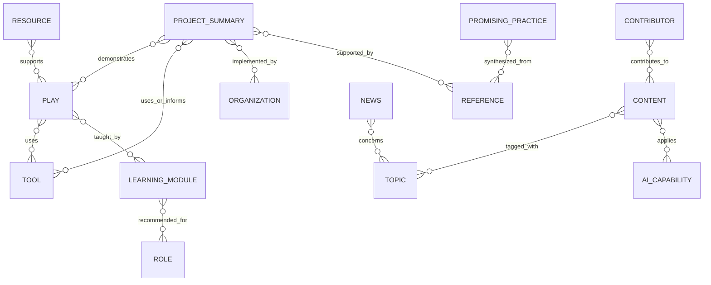

# Relationship Model

## Model

The platform uses typed, directed edges between stable content IDs. Relationships are stored once in their authoritative direction and inverse views are generated. For example, a tool stores `supports -> play:03`; the play page can derive “supported by tool.” Edge notes explain relevance; order is used only for curated sequences.

## Edge vocabulary

| Relationship | Source → target | Inverse label | Cardinality |
|---|---|---|---|
| `belongs_to_phase` | Play → Phase | contains play | many-to-one |
| `uses_tool` | Play → Tool | supports play | many-to-many |
| `prerequisite_for` | Content → Content | has prerequisite | many-to-many, acyclic where sequenced |
| `next_in_sequence` | Content → Content | previous in sequence | zero/one-to-zero/one |
| `recommended_for` | Content → Role | has recommendation | many-to-many |
| `recommended_at_maturity` | Content → Maturity | recommends content | many-to-many |
| `demonstrates` | Project Summary → Play/Topic/Capability | demonstrated by | many-to-many |
| `implemented_by` | Project Summary → Organization | has implementation | many-to-many |
| `supported_by` | Content/Claim → Reference | supports | many-to-many |
| `synthesized_from` | Promising Practice → Reference/Project Summary | informs synthesis | many-to-many |
| `teaches` | Learning Module → Play/Tool/Topic | taught by | many-to-many |
| `available_as` | Content → Resource/Asset | rendition of | one-to-many |
| `supersedes` | Content revision/item → Content | superseded by | zero/one-to-many |
| `contributed_by` | Content → Contributor | contributed to | many-to-many |
| `related_to` | Content → Content | related to | many-to-many; use sparingly |

## Integrity rules

- Every target ID must exist and be publishable in the current build.
- A record cannot relate to itself except a revision chain represented by distinct IDs.
- `next_in_sequence`, prerequisite graphs, and supersession chains cannot contain cycles.
- Project Summaries require at least one `supported_by` source; synthesized practices require `synthesized_from` plus disclosure.
- A tool’s `first_appears_in_play` must be one of its play relationships and agree with the lowest current play sequence unless an approved exception exists.
- Play/tool and learning crosswalk exports are generated from edges; hand-edited crosswalks are transitional only.
- Generic `related_to` is permitted only when no precise edge applies and must include a note.

## Curation and derived recommendations

Curated edges always outrank algorithmic similarity. Generated recommendations may use shared plays, roles, domains, AI capabilities, maturity, and references, but must be labeled “Related” rather than implying endorsement. Do not infer factual implementation, evidence, or organizational endorsement from shared tags.

## Relationship change control

Editors may propose ordinary relationships. Domain-sensitive edges—such as evidence support, implementation claims, legal applicability, or Tribal jurisdiction—require the relevant reviewer. Deleting an edge triggers an impact report listing pages, pathways, search facets, crosswalks, and publications that will change.
